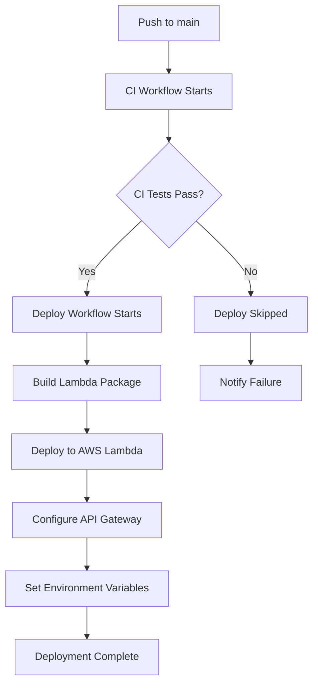

# 🚀 Deployment Guide - TravelStyle AI Backend

## Overview
This guide explains how to deploy your FastAPI backend to AWS Lambda using CI/CD with GitHub Actions. The application uses Mangum to make FastAPI compatible with Lambda and API Gateway.

## How the CI/CD Pipeline Works

### 1. CI Workflow (`Backend Quality CI/CD`)
**Triggers:** Push to `main`/`develop` branches
**What it does:**
- ✅ Runs linting (Ruff)
- ✅ Security scanning (Bandit)
- ✅ Unit tests (pytest)
- ✅ Coverage reporting
- ✅ Updates quality badges
- ✅ Uploads test reports

### 2. Deploy Workflow (`Deploy TravelStyle AI API to Lambda`)
**Triggers:**
- After CI workflow completes successfully on `main` branch
- Push to `main` branch (when backend files change)
- Manual workflow dispatch

**What it does:**
- 🚀 Creates optimized Lambda deployment package
- 📦 Deploys to AWS Lambda
- 🔧 Configures API Gateway
- ⚙️ Sets up environment variables
- ✅ Tests deployment

## Workflow Sequence



## Prerequisites

### 1. AWS Account Setup
1. Create an AWS account at [aws.amazon.com](https://aws.amazon.com)
2. Install AWS CLI:
   ```bash
   # macOS
   brew install awscli

   # Or using pip
   pip install awscli
   ```

3. Configure AWS credentials:
   ```bash
   aws configure
   # Enter your AWS Access Key ID
   # Enter your AWS Secret Access Key
   # Enter your default region (e.g., us-east-1)
   # Enter default output format (json)
   ```

### 2. AWS IAM Setup

Create an IAM role for Lambda with the following permissions:

**Required Policies:**
- `AWSLambdaBasicExecutionRole` (for CloudWatch Logs)
- Custom policy for any additional AWS services you use

**Create Lambda Execution Role:**
```bash
# Create the role
aws iam create-role \
  --role-name TravelStyleLambdaRole \
  --assume-role-policy-document '{
    "Version": "2012-10-17",
    "Statement": [{
      "Effect": "Allow",
      "Principal": {"Service": "lambda.amazonaws.com"},
      "Action": "sts:AssumeRole"
    }]
  }'

# Attach basic execution policy
aws iam attach-role-policy \
  --role-name TravelStyleLambdaRole \
  --policy-arn arn:aws:iam::aws:policy/service-role/AWSLambdaBasicExecutionRole

# Get the role ARN (you'll need this for GitHub Secrets)
aws iam get-role --role-name TravelStyleLambdaRole --query 'Role.Arn' --output text
```

### 3. S3 Bucket (Optional, for large deployments)
If your deployment package exceeds 50MB, you'll need an S3 bucket:

```bash
# Create S3 bucket
aws s3 mb s3://your-lambda-deployments-bucket --region us-east-1
```

## GitHub Secrets Setup

Add these secrets to your GitHub repository (`Settings > Secrets and variables > Actions`):

### AWS Configuration
| Secret Name | Description | How to get |
|-------------|-------------|------------|
| `AWS_ACCESS_KEY_ID` | AWS access key | From AWS IAM console |
| `AWS_SECRET_ACCESS_KEY` | AWS secret key | From AWS IAM console |
| `AWS_REGION` | AWS region | e.g., `us-east-1` |
| `LAMBDA_FUNCTION_NAME` | Lambda function name | e.g., `travelstyle-api` |
| `LAMBDA_ROLE_ARN` | IAM role ARN for Lambda | From IAM role creation |
| `LAMBDA_S3_BUCKET` | S3 bucket for deployments | Optional, for large packages |

### API Keys
| Secret Name | Description |
|-------------|-------------|
| `OPENAI_API_KEY` | OpenAI API key |
| `OPENAI_ORG_ID` | OpenAI organization ID (optional) |
| `QLOO_API_KEY` | Qloo API key |
| `OPENWEATHER_API_KEY` | OpenWeather API key |
| `VISUALCROSSING_API_KEY` | VisualCrossing API key |
| `EXCHANGE_API_KEY` | Exchange Rate API key |

### Database
| Secret Name | Description |
|-------------|-------------|
| `SUPABASE_URL` | Supabase project URL |
| `SUPABASE_KEY` | Supabase anon/service key |

### Image Storage
| Secret Name | Description |
|-------------|-------------|
| `CLOUDINARY_CLOUD_NAME` | Cloudinary cloud name |
| `CLOUDINARY_API_KEY` | Cloudinary API key |
| `CLOUDINARY_API_SECRET` | Cloudinary API secret |

## Lambda Configuration

The Lambda function is configured with the following settings:

- **Runtime**: Python 3.13
- **Handler**: `app.travelstyle.handler`
- **Timeout**: 30 seconds
- **Memory**: 2048 MB
- **Ephemeral Storage**: 2048 MB
- **Architecture**: x86_64

## How to Trigger Deployment

### Automatic Deployment
1. **Push to `main` branch** (when backend files change)
2. **CI workflow runs** (quality checks)
3. **If CI passes** → Deploy workflow automatically starts
4. **If CI fails** → Deployment is skipped

### Manual Deployment
1. Go to **Actions** tab in GitHub
2. Select **"Deploy TravelStyle AI API to Lambda"** workflow
3. Click **"Run workflow"**
4. Select branch and click **"Run workflow"**

### Manual CLI Deployment

If you need to deploy manually using AWS CLI:

```bash
cd backend

# Create deployment package
mkdir -p lambda-package
cp -r app lambda-package/
pip install -r requirements.txt -t lambda-package/ --quiet

# Clean up unnecessary files
find lambda-package -type d -name "__pycache__" -exec rm -rf {} + 2>/dev/null
find lambda-package -type f -name "*.pyc" -delete
find lambda-package -type d -name "*.dist-info" -exec rm -rf {} + 2>/dev/null
find lambda-package -type d -name "tests" -exec rm -rf {} + 2>/dev/null

# Create zip file
cd lambda-package
zip -r ../lambda-deploy.zip . -q
cd ..

# Deploy to Lambda
aws lambda update-function-code \
  --function-name travelstyle-api \
  --zip-file fileb://lambda-deploy.zip

# Update environment variables
aws lambda update-function-configuration \
  --function-name travelstyle-api \
  --environment "Variables={
    OPENAI_API_KEY=$OPENAI_API_KEY,
    OPENAI_ORG_ID=$OPENAI_ORG_ID,
    QLOO_API_KEY=$QLOO_API_KEY,
    OPENWEATHER_API_KEY=$OPENWEATHER_API_KEY,
    VISUALCROSSING_API_KEY=$VISUALCROSSING_API_KEY,
    EXCHANGE_API_KEY=$EXCHANGE_API_KEY,
    SUPABASE_URL=$SUPABASE_URL,
    SUPABASE_KEY=$SUPABASE_KEY,
    CLOUDINARY_CLOUD_NAME=$CLOUDINARY_CLOUD_NAME,
    CLOUDINARY_API_KEY=$CLOUDINARY_API_KEY,
    CLOUDINARY_API_SECRET=$CLOUDINARY_API_SECRET
  }"

# Clean up
rm -rf lambda-package lambda-deploy.zip
```

## Testing Deployment

After deployment, test your endpoints:

```bash
# Get your API Gateway URL
API_URL=$(aws apigatewayv2 get-apis --query "Items[?Name=='TravelStyleAPI'].ApiEndpoint" --output text)

# Health check
curl $API_URL/health

# API docs
curl $API_URL/docs

# Root endpoint
curl $API_URL/
```

Or test directly with Lambda:

```bash
# Test Lambda function directly
aws lambda invoke \
  --function-name travelstyle-api \
  --payload '{"httpMethod":"GET","path":"/health","headers":{},"queryStringParameters":null,"body":null}' \
  response.json

cat response.json
```

## Monitoring Deployments

### GitHub Actions
- **Actions tab** → View workflow runs
- **Workflow logs** → Check deployment progress
- **Status badges** → Monitor quality metrics

### AWS CloudWatch
- **Logs**: View Lambda function logs
  ```bash
  aws logs tail /aws/lambda/travelstyle-api --follow
  ```
- **Metrics**: Monitor function performance
  - Invocations
  - Duration
  - Errors
  - Throttles
- **Dashboards**: Create custom dashboards for monitoring

### AWS Lambda Console
- **Functions** → View function configuration and code
- **Test** → Test function with sample events
- **Monitoring** → View metrics and logs
- **Configuration** → Update settings and environment variables

## Workflow Status

| Status | Meaning | Action |
|--------|---------|--------|
| ✅ **Success** | CI passed, deployed to Lambda | Check API Gateway URL |
| ❌ **Failure** | CI failed, deployment skipped | Fix issues, push again |
| ⏳ **Running** | Workflow in progress | Wait for completion |
| 🚫 **Cancelled** | Workflow was cancelled | Re-run manually |

## Troubleshooting

### Common Issues:

1. **Environment Variables Missing**
   - Check Lambda function configuration in AWS Console
   - Verify all secrets are set in GitHub Secrets
   - Ensure environment variables are properly formatted

2. **Build Failures**
   - Check GitHub Actions logs for package creation errors
   - Ensure `requirements.txt` is in `backend/` directory
   - Verify Python version compatibility (3.13)

3. **Import Errors**
   - Check Lambda handler path: `app.travelstyle.handler`
   - Verify all dependencies are in `requirements.txt`
   - Ensure package structure is correct

4. **Deployment not triggering**
   - Check if CI workflow passed
   - Verify secrets are configured in GitHub
   - Check workflow file paths match your branch structure
   - Ensure workflow has proper permissions

5. **Lambda deployment fails**
   - Check AWS credentials and permissions
   - Verify IAM role has correct permissions
   - Check Lambda function limits (timeout, memory)
   - Review CloudWatch logs for runtime errors

6. **API Gateway Issues**
   - Verify API Gateway is created/updated
   - Check CORS configuration
   - Ensure routes are properly configured
   - Test with direct Lambda invocation first

7. **Package Size Issues**
   - Lambda package must be < 50MB (zipped) or < 250MB (unzipped)
   - Use Lambda Layers for large dependencies
   - Remove unnecessary files from package
   - Consider using S3 for deployment if package is too large

### Debug Commands:

```bash
# Check Lambda function status
aws lambda get-function --function-name travelstyle-api

# View Lambda function logs
aws logs tail /aws/lambda/travelstyle-api --follow

# Test Lambda function
aws lambda invoke \
  --function-name travelstyle-api \
  --payload '{"httpMethod":"GET","path":"/health"}' \
  response.json

# Check API Gateway APIs
aws apigatewayv2 get-apis

# View recent Lambda invocations
aws lambda list-functions --query 'Functions[?FunctionName==`travelstyle-api`]'

# Check function configuration
aws lambda get-function-configuration --function-name travelstyle-api

# View environment variables
aws lambda get-function-configuration \
  --function-name travelstyle-api \
  --query 'Environment.Variables'

# Check IAM role permissions
aws iam get-role --role-name TravelStyleLambdaRole
```

## Best Practices

1. **Always test locally** before pushing
   ```bash
   make test-quick
   make run  # Test locally on port 8000
   ```

2. **Check CI results** before expecting deployment
   - Monitor GitHub Actions for test results
   - Fix any linting or security issues

3. **Monitor deployment logs** for issues
   - Check GitHub Actions logs
   - Monitor CloudWatch logs after deployment

4. **Set up CloudWatch alarms** for production
   - Error rate monitoring
   - Duration monitoring
   - Throttle monitoring

5. **Use feature branches** for development
   - Test changes in feature branches
   - Only deploy from `main` branch

6. **Review changes** before merging to main
   - Code review process
   - Ensure all tests pass

7. **Optimize package size**
   - Remove unnecessary dependencies
   - Use Lambda Layers for common dependencies
   - Clean up test files and documentation

## Cost Optimization

### AWS Lambda Pricing
- **Free Tier**: 1M requests/month, 400,000 GB-seconds compute time
- **Pay per use**: $0.20 per 1M requests + $0.0000166667 per GB-second
- **Optimization tips**:
  - Use appropriate memory allocation (start with 512MB, increase if needed)
  - Set appropriate timeout values
  - Implement caching to reduce invocations
  - Use Lambda Layers to reduce package size

### API Gateway Pricing
- **REST API**: $3.50 per million requests
- **HTTP API**: $1.00 per million requests (cheaper option)
- Consider using HTTP API for cost savings

### CloudWatch Pricing
- **Logs**: $0.50 per GB ingested
- **Metrics**: First 10 custom metrics free
- Set log retention policies to reduce costs

## Security Notes

- **All API keys** are stored as Lambda environment variables (encrypted at rest)
- **IAM roles** use least privilege principle
- **CORS** is configured (update for production with specific origins)
- **TrustedHostMiddleware** is set (update for production with specific hosts)
- **Row-Level Security (RLS)** is enabled in Supabase
- **JWT tokens** are used for authentication
- **Secure cookies** are used for session management

## Lambda Optimization

The deployment process includes several optimizations:

1. **Package Size Reduction** (~50% reduction)
   - Removes `__pycache__` directories
   - Removes test files and documentation
   - Optimized dependency installation

2. **Lambda Layers** (optional)
   - Can be used for common dependencies
   - Reduces function package size
   - Speeds up deployments

3. **Cold Start Optimization**
   - Appropriate memory allocation (2048 MB)
   - Efficient imports
   - Connection pooling for database

## Next Steps

1. **Set up AWS account** and configure IAM roles
2. **Configure GitHub Secrets** with all required values
3. **Test the workflow** with a small change
4. **Monitor the first deployment** and verify it works
5. **Set up CloudWatch alarms** for production monitoring
6. **Configure custom domain** in API Gateway (optional)
7. **Set up production CORS** settings with specific origins
8. **Implement rate limiting** at API Gateway level
9. **Set up CloudWatch dashboards** for monitoring
10. **Configure log retention** policies to manage costs
11. **Set up AWS X-Ray** for distributed tracing (optional)
12. **Review and optimize** Lambda memory and timeout settings
