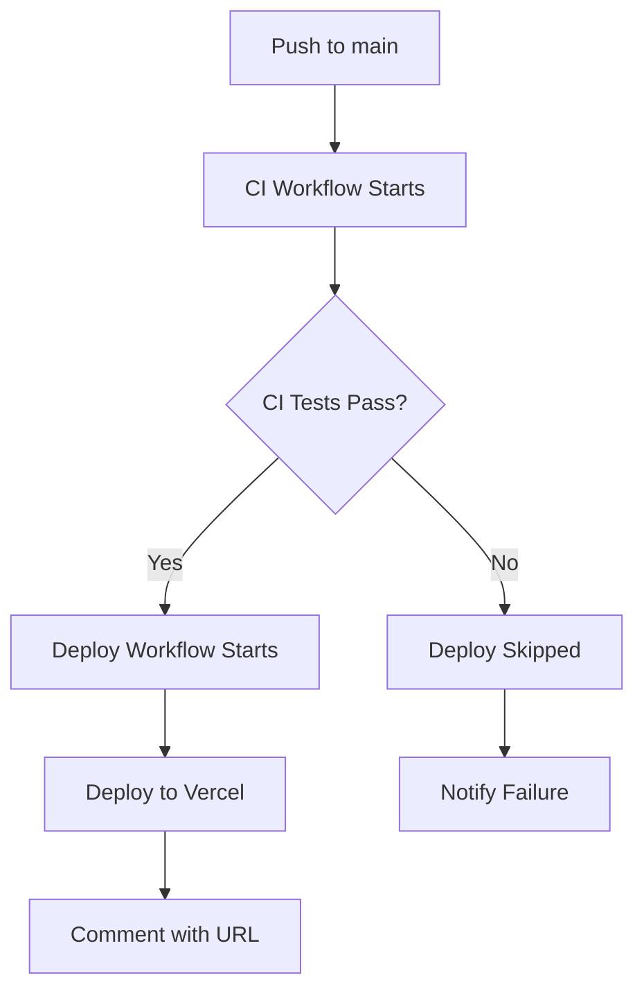

# 🚀 Deployment Guide - TravelStyle AI Backend

## Overview
This guide explains how to deploy your FastAPI backend to Vercel using CI/CD with GitHub Actions.

## How the CI/CD Pipeline Works

### 1. CI Workflow (`ci.yml`)
**Triggers:** Push to `main`/`develop` branches
**What it does:**
- ✅ Runs linting (Ruff)
- ✅ Security scanning (Bandit)
- ✅ Unit tests (pytest)
- ✅ Coverage reporting
- ✅ Updates quality badges
- ✅ Uploads test reports

### 2. Deploy Workflow (`deploy.yml`)
**Triggers:** After CI workflow completes successfully
**What it does:**
- 🚀 Deploys to Vercel production
- 📝 Comments on workflow with deployment URL
- ❌ Skips deployment if CI fails

## Workflow Sequence



## Prerequisites

### 1. Vercel Account Setup
1. Go to [vercel.com](https://vercel.com) and sign up/login
2. Install Vercel CLI locally:
   ```bash
   npm install -g vercel
   ```

### 2. Initial Vercel Project Setup
```bash
# Login to Vercel
vercel login

# Link your project (run from project root)
vercel link

# Deploy manually first time
vercel --prod

# Get your project info
vercel project ls
```

### 3. Get Required Secrets
After linking, you'll need these values for GitHub Secrets:

```bash
# Get your Vercel token
vercel whoami
```

## GitHub Secrets Setup

Add these secrets to your GitHub repository (`Settings > Secrets and variables > Actions`):

| Secret Name | Description | How to get |
|-------------|-------------|------------|
| `VERCEL_TOKEN` | Vercel API token | Run `vercel whoami` |
| `VERCEL_ORG_ID` | Your Vercel organization ID | From Vercel dashboard |
| `VERCEL_PROJECT_ID` | Your Vercel project ID | From `vercel project ls` |

## Environment Variables

Add these to your Vercel project dashboard (`Settings > Environment Variables`):

```
OPENAI_API_KEY=your_openai_key
OPENAI_ORG_ID=your_openai_org_id
QLOO_API_KEY=your_qloo_key
OPENWEATHER_API_KEY=your_openweather_key
EXCHANGE_API_KEY=your_exchange_key
SUPABASE_URL=your_supabase_url
SUPABASE_KEY=your_supabase_key
```

## How to Trigger Deployment

### Automatic Deployment
1. **Push to `main` branch**
2. **CI workflow runs** (quality checks)
3. **If CI passes** → Deploy workflow automatically starts
4. **If CI fails** → Deployment is skipped

### Manual Deployment
1. Go to **Actions** tab in GitHub
2. Select **"Deploy to Vercel"** workflow
3. Click **"Run workflow"**
4. Select branch and click **"Run workflow"**

### Manual CLI Deployment
```bash
# Deploy to preview
vercel

# Deploy to production
vercel --prod
```

## Testing Deployment

After deployment, test your endpoints:

```bash
# Health check
curl https://your-project.vercel.app/health

# API docs
curl https://your-project.vercel.app/docs
```

## Monitoring Deployments

### GitHub Actions
- **Actions tab** → View workflow runs
- **Workflow comments** → Get deployment URLs
- **Status badges** → Monitor quality metrics

### Vercel Dashboard
- **Deployments** → View deployment history
- **Functions** → Monitor serverless functions
- **Analytics** → Track performance
- **Logs**: Check Vercel function logs for debugging

## Workflow Status

| Status | Meaning | Action |
|--------|---------|--------|
| ✅ **Success** | CI passed, deployed to Vercel | Check deployment URL |
| ❌ **Failure** | CI failed, deployment skipped | Fix issues, push again |
| ⏳ **Running** | Workflow in progress | Wait for completion |
| 🚫 **Cancelled** | Workflow was cancelled | Re-run manually |

## Troubleshooting

### Common Issues:

1. **Environment Variables Missing**
   - Check Vercel dashboard > Settings > Environment Variables
   - Ensure all required env vars are set

2. **Build Failures**
   - Check Vercel build logs
   - Ensure `requirements.txt` is in root directory

3. **Import Errors**
   - Verify `PYTHONPATH` is set correctly in `vercel.json`
   - Check file paths in imports

4. **Deployment not triggering**
   - Check if CI workflow passed
   - Verify secrets are configured
   - Check workflow permissions

5. **Vercel deployment fails**
   - Check Vercel project settings
   - Verify environment variables
   - Check build logs in Vercel dashboard

### Debug Commands:

```bash
# Check Vercel project status
vercel ls

# View deployment logs
vercel logs

# View recent deployments
vercel ls --limit=5

# Check environment variables
vercel env ls

# Redeploy with debug info
vercel --debug

# Redeploy manually
vercel --prod
```

## Best Practices

1. **Always test locally** before pushing
2. **Check CI results** before expecting deployment
3. **Monitor deployment logs** for issues
4. **Set up notifications** for deployment status
5. **Use feature branches** for development
6. **Review changes** before merging to main

## Cost Optimization

- Vercel's free tier includes:
  - 100GB-hours of serverless function execution
  - 100GB bandwidth
  - Perfect for development and small production loads

## Security Notes

- All API keys are stored as Vercel environment variables
- CORS is configured for development (update for production)
- TrustedHostMiddleware is set to allow all hosts (update for production)

## Next Steps

1. **Set up your Vercel project** and get the required secrets
2. **Configure environment variables** in Vercel dashboard
3. **Test the workflow** with a small change
4. **Monitor the first deployment** and verify it works
5. **Set up monitoring** and alerts for production
6. Set up custom domain in Vercel dashboard
7. Configure production CORS settings
8. Implement rate limiting for production
